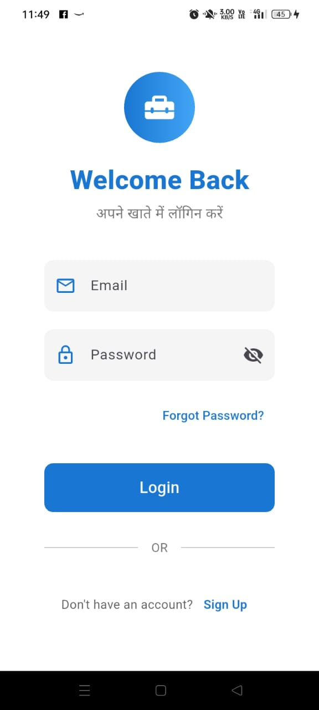
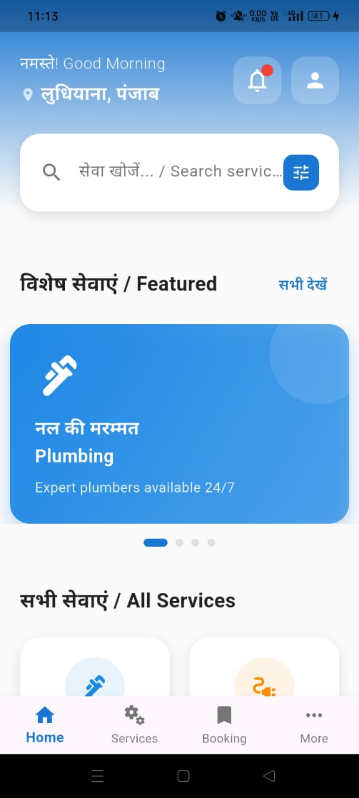
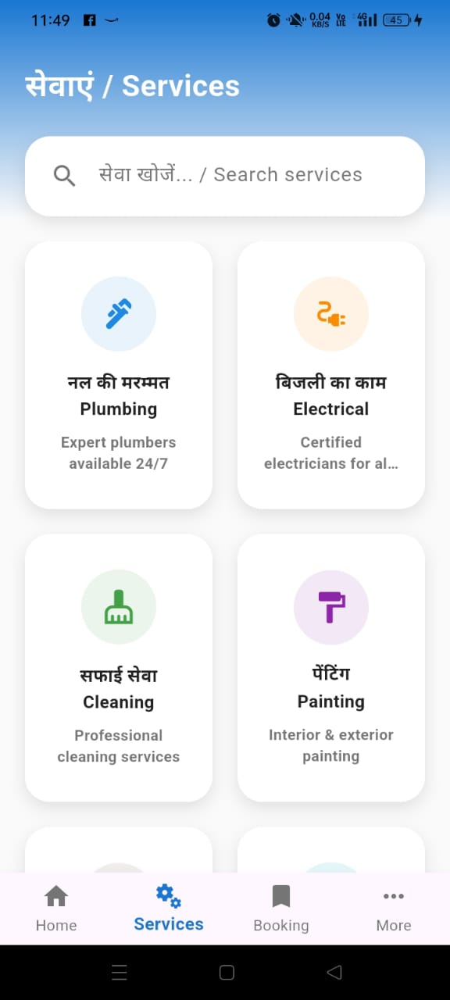
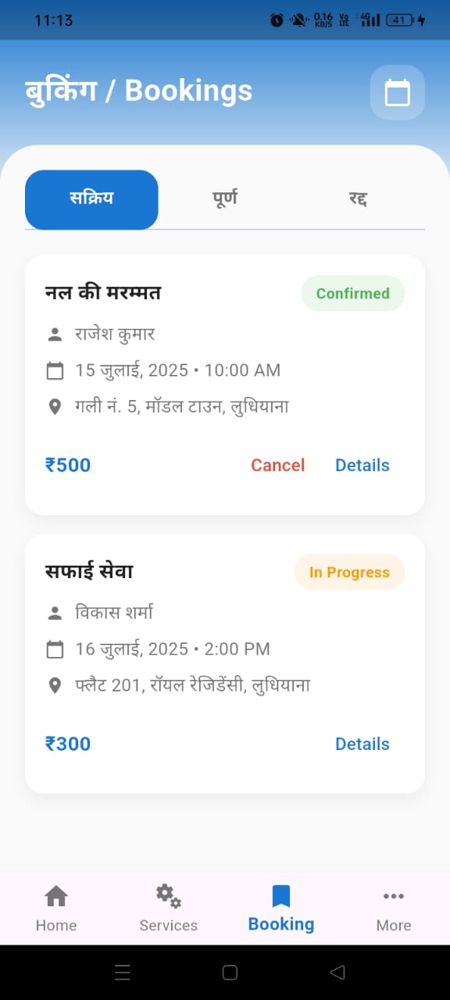

# SewaXPress

SewaXPress is a complete on-demand home and professional services app, inspired by Urban Company. It allows users to discover, book, and manage services like cleaning, plumbing, salon, and repairs with just a few taps.  
This repository contains the Flutter source code and assets for mobile, with a structured backend setup ready for integration.

---

## Screenshots

| Login Screen | Home Screen | Services Screen | Bookings Screen |
|---------------|--------------|-----------------|----------------|
|  |  |  |  |

## Features

- User Authentication (Signup, Login, OTP Verification)
- Search and Explore Services
- Real-Time Booking & Scheduling
- Booking History & Management
- Location-Based Service Availability
- Service Provider Dashboard
- Admin Dashboard
- Help and Support

---

## Tech Stack

**Frontend:** Flutter (Dart)  
**Backend:** Appwrite  
**Database:** Firestore  
**Auth:** Firebase Authentication  
**Hosting:** N/A
**Payment:** Razorpay (can be used)
**Notifications:** Firebase Cloud Messaging (FCM)

---

## Installation & Setup

Follow these steps to run the project locally:

1. **Clone the Repository**
   ```
   git clone https://github.com/yourusername/sewaxpress.git
   cd sewaxpress
   ```

2. **Install Dependencies**
   ```
   flutter pub get
   ```

3. **Run the App**
   ```
   flutter run
   ```

Make sure you have the Flutter SDK installed and configured (`flutter doctor` to verify).

---

## Future Enhancements

- AI-Powered Service Recommendations
- Advanced Filtering & Sorting
- Multi-Language Support (English, Hindi, etc.)
- Call Integration between User & Provider
- Subscription & Loyalty Program
- Dynamic Pricing Based on Demand
- Analytics Dashboard for Admin

---

## Contributing

Contributions are welcome!  
To contribute:

1. Fork the repository  
2. Create a branch:  
   ```
   git checkout -b feature-name
   ```
3. Commit your changes:  
   ```
   git commit -m "Add new feature"
   ```
4. Push to your branch:  
   ```
   git push origin feature-name
   ```
5. Create a Pull Request

---

## Feedback

Have suggestions or found a bug?  
Open an issue in the **[Issues](https://github.com/yourusername/sewaxpress/issues)** section  

---

⭐️ **If you like this project, please star the repo!**
